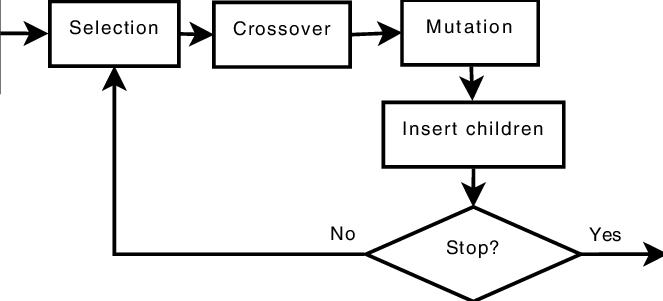

# 🚗 Driving AI Using Genetic Algorithm


  
  

## 📝 Project Description 
This project features an AI that learns to drive with [my driving game](https://github.com/Thibault-GAREL/driving_game) autonomously using genetic algorithm (without NEAT). No hardcoded strategies — the agent improves over generations through genetic mutations and natural selection. 🧬🤖

---

## ⚙️ Features
  🔄 No supervised learning – only evolution by fitness

  🧠 Networks evolve weights with crossover and mutation but not topologies (like NEAT)

  📊 Real-time simulation with visualization

  🏆 Tracks best fitness, average scores, and generation and save best brains


## Example Outputs
Here is an image of what it looks like :


Here it's when it starts with all the population alive :


---

## ⚙️ How it works

  🕹️ The AI controls a car (red when alive ❤️, gray when dead 🩶 and green when the best 💚) in a classic grid-based [🐍 Snake game](https://github.com/Thibault-GAREL/snake_game).

  🧬 It evolves over time : networks mutate, reproduce, and get selected based on performance (fitness).

  👁️ Visual interface shows the best car live as it learns.


## 🗺️ Schema
💡 Here is a schema for a better explanation :



🧪 You can also withdraw the display for a quicker training (show = False in drive.py) and load a brain (load = True in drive.py and filename = "best_brainXX.npz" in ia.py) !

🔥💻 In 5-10 min, the car is starting to have the best trajectory !

---

## 📂 Repository structure  
```bash
├── Img/
│
├── best_brain.npz
├── best_brain2.npz
├── best_brain__check4.npz
│
├── drive.py
├── ia.py
├── main.py
│
├── LICENSE
├── README.md
```

---

## 💻 Run it on Your PC  
Clone the repository and install dependencies:  
```bash
git clone https://github.com/Thibault-GAREL/AI_driving_genetic_version.git
cd AI_driving_genetic_version

python -m venv .venv #if you don't have a virtual environnement
source .venv/bin/activate   # Linux / macOS
.venv\Scripts\activate      # Windows

pip install numpy pygame

python main.py
```
---

## 📖 Inspiration / Sources  
I code it without any help 😆 !

Code created by me 😎, Thibault GAREL - [Github](https://github.com/Thibault-GAREL)